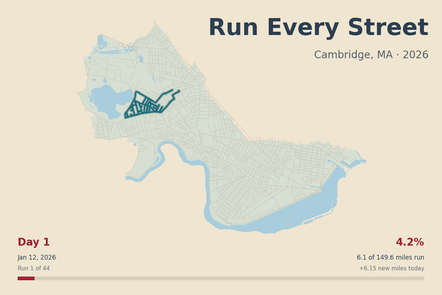

It started with me running every street in Cambridge, Massachusetts. It ended with me writing about it [here](https://rachelfranklin.substack.com/p/geography-antics?r=3xp53), on my SubStack (a habit I meant to kick in favor of this outlet, but can't seem to).

In between, when I told Dani Arribas-Bel about my accomplishment, he said, you could get Claude to make a nice gif of all your runs. And he was right. I handed a folder of all the .gpx files of my runs, as well as the Cambridge streets layer I was working from, and it didn't take it long at all to make something very visually appealing that looked exactly as if it had been made by Claude.

Not much else to say, except that, by my calculations, there are about 156 miles of streets in Cambridge.

